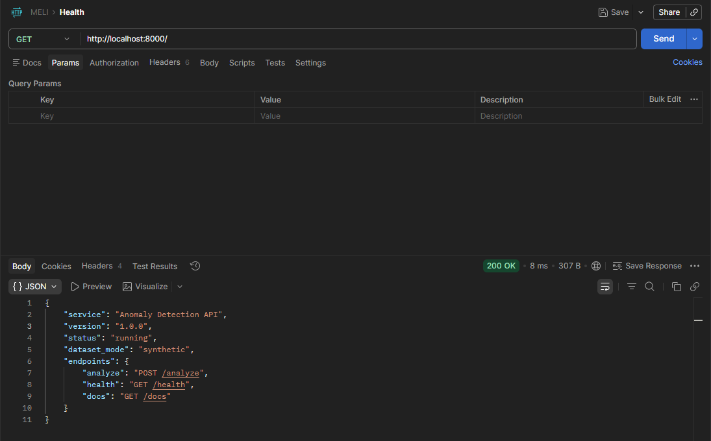
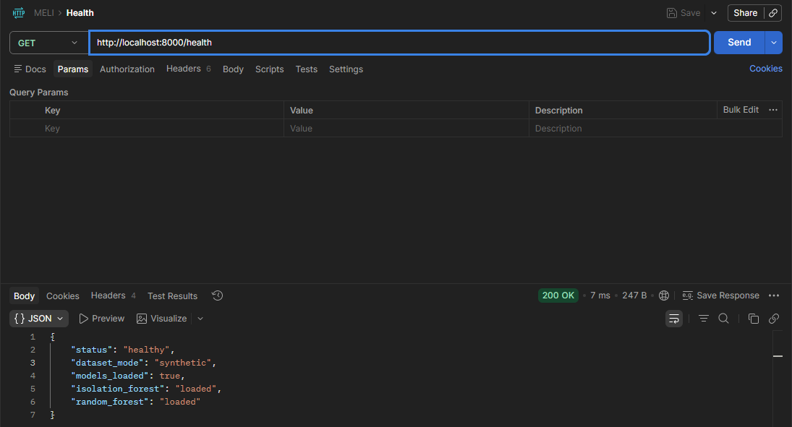
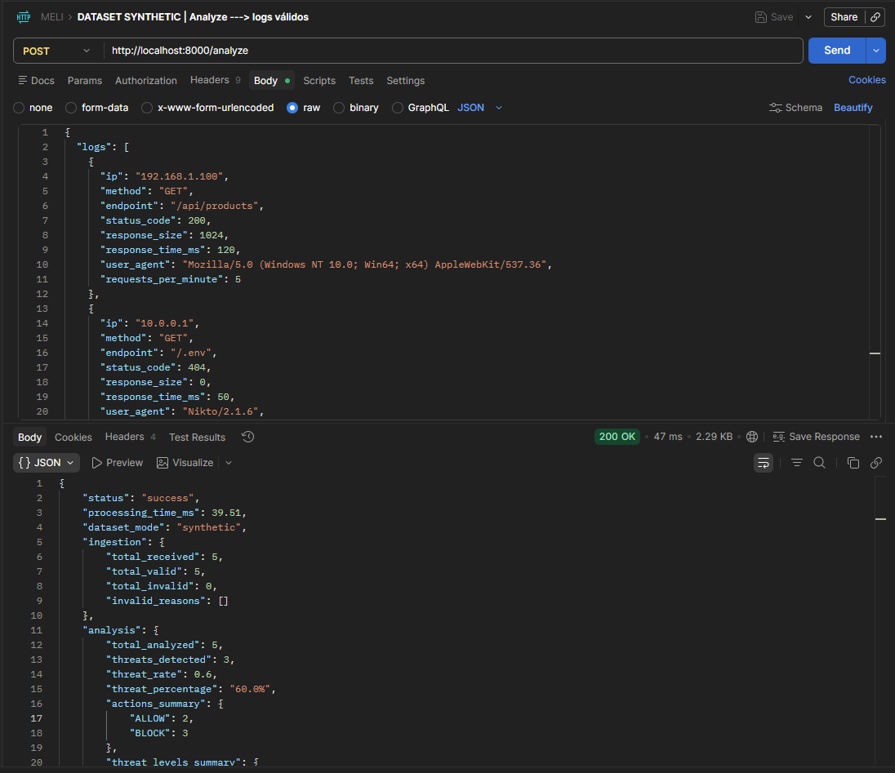
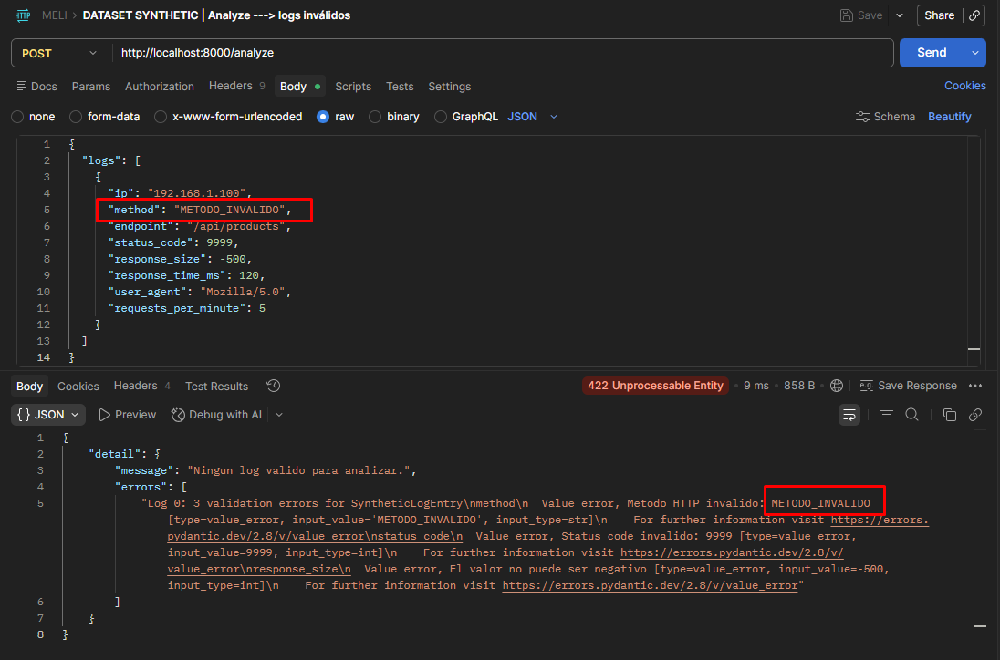
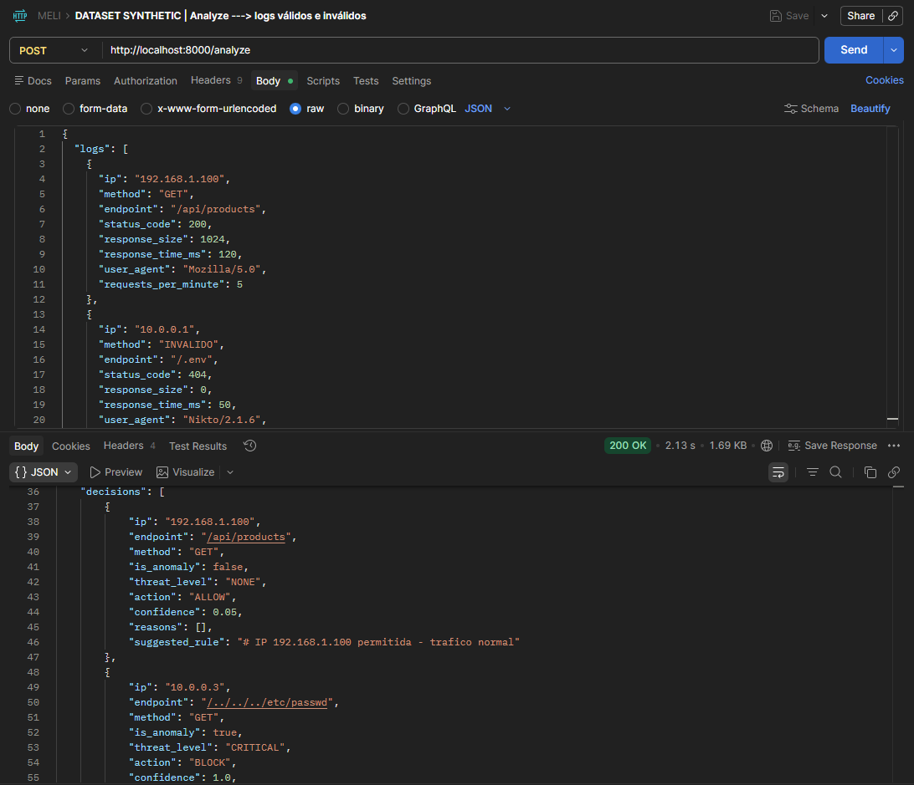
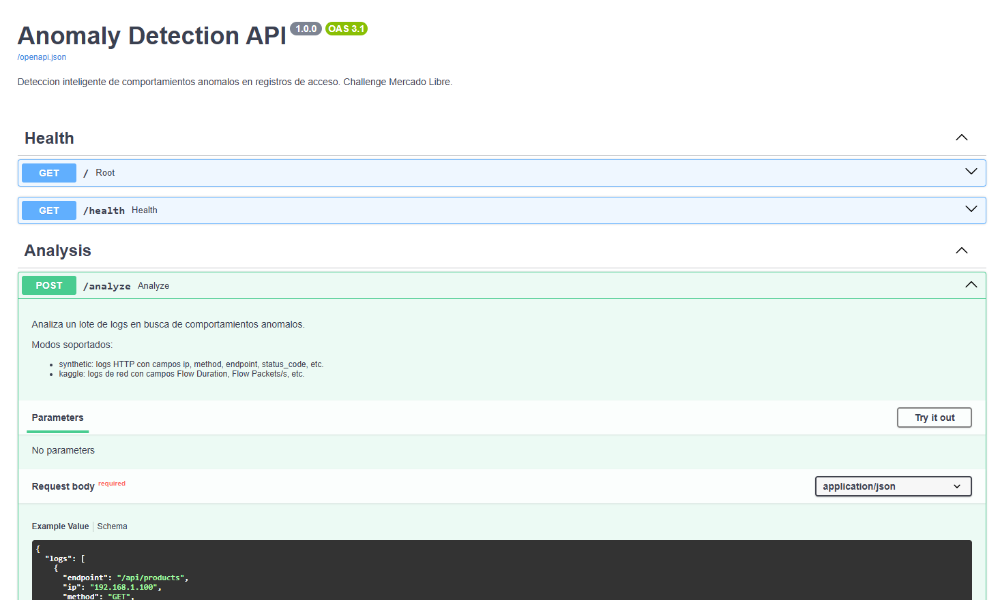
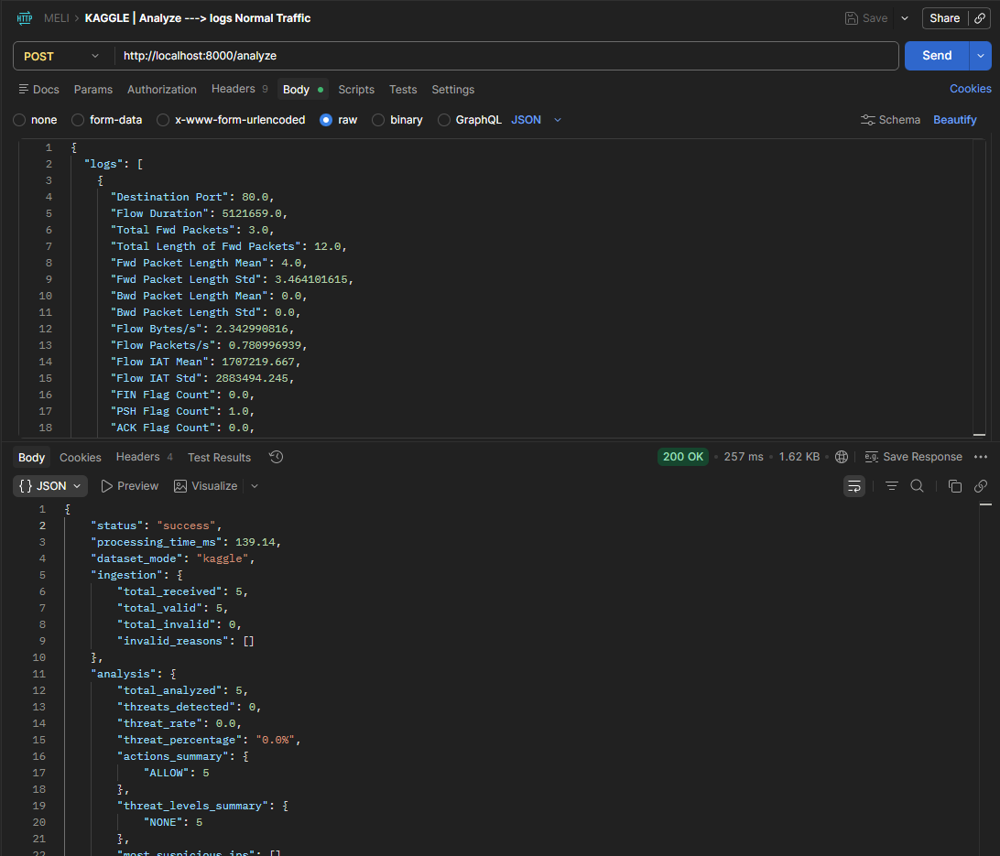
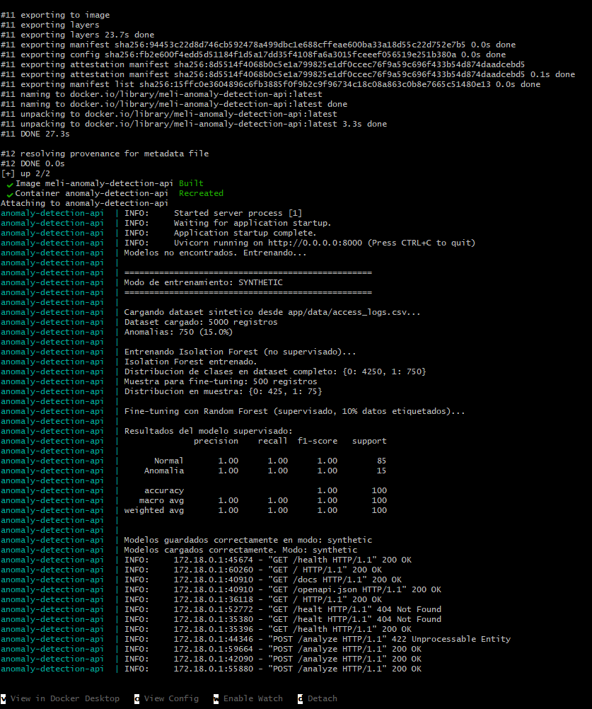

# Anomaly Detection API — Challenge Mercado Libre

Sistema de detección inteligente de comportamientos anómalos en registros de acceso HTTP, utilizando modelos de IA y una arquitectura de agentes.

---

## Índice

1. [Descripción general](#descripción-general)
2. [Arquitectura y flujo de agentes](#arquitectura-y-flujo-de-agentes)
3. [Tecnologías](#tecnologías)
4. [Dataset](#dataset)
5. [Instalación y ejecución](#instalación-y-ejecución)
6. [Uso de la API](#uso-de-la-api)
7. [Imágenes de la aplicación funcionando](#imágenes-de-la-aplicación-funcionando)
8. [Estructura del proyecto](#estructura-del-proyecto)

---

## Descripción general

La API recibe lotes de logs de acceso, los procesa a través de dos agentes de IA y devuelve una clasificación de amenazas con acciones sugeridas (BLOCK, ALERT, MONITOR, ALLOW) y reglas de firewall listas para implementar.

El sistema soporta dos modos de operación configurables via variable de entorno:

- **`synthetic`** — dataset ficticio de logs HTTP diseñado para simular ataques comunes en plataformas WordPress/WooCommerce (brute force, scanners, SQL injection, path traversal, DoS)
- **`kaggle`** — dataset real CICIDS2017 con más de 2.5 millones de registros de tráfico de red etiquetados (Normal Traffic, DDoS, Port Scanning, Brute Force, Web Attacks, Bots)

### Apartado informativo

    EL dataset utilizado por defecto es uno generado teniendo en cuenta el challenge de riesgos y vulnerabilidades. Luego se realizaron los cambios pertinentes en el código para adaptarlo al dataset de Kaggle. Este no viene por defecto en el repositorio ya que era muy pesado y Github me tiraba error. Intenté solucionar esto último creando una EC2 en mi cuenta personal de AWS y levantando la dockerización, pero al realizar los ajuntes del security group para pegarle por el puerto 8000 resultó que tardó demasiado en procesar los 2.5M de datos para entrenar a los modelos de IA, sin emabrgo, luego se desarrollan las instrucciones de cómo descargar el .csv de Kaggle y el path correspondiente.

---

## Arquitectura y flujo de agentes

```
[Cliente]
    │
    ▼
POST /analyze
    │
    ▼
┌─────────────────────────────────┐
│       Agente 1: Ingestor        │
│  • Valida schema con Pydantic   │
│  • Normaliza campos             │
│  • Enriquece con metadata       │
│  • Rechaza logs malformados     │
└─────────────────────────────────┘
    │
    ▼ logs válidos
┌─────────────────────────────────┐
│         Modelo de IA            │
│                                 │
│  Isolation Forest (no superv.)  │
│  + Random Forest (supervisado)  │
│    fine-tuning con 10% datos    │
│                                 │
│  → Consenso de ambos modelos    │
│  → Score de confianza 0.0-1.0   │
└─────────────────────────────────┘
    │
    ▼ resultados con scores
┌─────────────────────────────────┐
│      Agente 2: Decisión         │
│  • Aplica reglas de negocio     │
│  • Clasifica nivel de amenaza   │
│  • Sugiere acción               │
│  • Genera reglas de firewall    │
│  • Produce recomendaciones      │
└─────────────────────────────────┘
    │
    ▼
JSON Response:
  BLOCK / ALERT / MONITOR / ALLOW
```

### Agente 1 — Ingestor (`app/agents/ingestion.py`)

Recibe los logs crudos del cliente y los prepara para el modelo:

- Valida el schema de cada log via Pydantic con reglas estrictas (métodos HTTP válidos, status codes en rango 100-599, valores no negativos)
- En modo `synthetic`: todos los campos HTTP son obligatorios
- En modo `kaggle`: solo requiere `ip`, el resto son opcionales
- Normaliza campos (métodos a mayúsculas, timestamps automáticos)
- Enriquece cada log con features adicionales (profundidad del endpoint, presencia de query params)
- Logs inválidos son rechazados y reportados sin interrumpir el procesamiento del lote completo

### Modelo de IA (`app/model/`)

Combina dos modelos en consenso para mayor robustez:

**Isolation Forest (no supervisado):**
Entrenado con el dataset completo sin ver las etiquetas. Detecta anomalías por aislamiento estadístico — los registros difíciles de aislar son normales, los que se aíslan con pocas preguntas son anómalos.

**Random Forest (supervisado — fine-tuning):**
Entrenado con el 10% del dataset etiquetado usando muestreo estratificado para garantizar representación de ambas clases. Aprende los patrones específicos de cada tipo de ataque con mayor precisión.

**Consenso:** si cualquiera de los dos modelos detecta anomalía, el log se marca como sospechoso. El score de confianza combina ambas señales en un valor entre 0.0 y 1.0.

### Agente 2 — Decisión (`app/agents/decision.py`)

Transforma los scores del modelo en decisiones accionables:

**Modo synthetic:**

| Condición | Nivel | Acción |
|---|---|---|
| Endpoint crítico (`/.env`, `/wp-config.php`, etc.) o patrón de ataque (`OR '1'='1`, `../`) | CRITICAL | BLOCK |
| Confidence ≥ 0.80 | HIGH | BLOCK |
| Confidence ≥ 0.50 | MEDIUM | ALERT |
| Confidence < 0.50 | LOW | MONITOR |
| No anomalía | NONE | ALLOW |

**Modo kaggle:**

| Condición | Nivel | Acción |
|---|---|---|
| Confidence ≥ 0.85 | CRITICAL | BLOCK |
| Confidence ≥ 0.70 | HIGH | BLOCK |
| Confidence ≥ 0.50 | MEDIUM | ALERT |
| Confidence < 0.50 | LOW | MONITOR |
| No anomalía | NONE | ALLOW |

---

## Tecnologías

| Tecnología | Versión | Uso |
|---|---|---|
| Python | 3.11 | Lenguaje principal |
| FastAPI | 0.115.0 | Framework API REST |
| Scikit-learn | 1.5.2 | Isolation Forest + Random Forest |
| Pandas | 2.2.3 | Procesamiento de datos |
| NumPy | 1.26.4 | Operaciones numéricas |
| Pydantic | 2.8.2 | Validación de schemas |
| Uvicorn | 0.30.6 | Servidor ASGI |
| Docker | — | Containerización |

---

## Dataset

### Modo synthetic (por defecto)

Dataset ficticio generado sintéticamente que simula logs de acceso HTTP de una plataforma de e-commerce WordPress/WooCommerce. Fue diseñado para cubrir los tipos de ataque más comunes en este tipo de plataformas:

| Tipo de ataque | Descripción | Señales características |
|---|---|---|
| `brute_force` | Intentos repetidos de login | POST `/wp-login.php`, 60-300 req/min, status 401/403 |
| `scanner` | Escaneo de archivos sensibles | GET `/.env`, `/wp-admin`, User-Agent de herramientas como Nikto |
| `sql_injection` | Inyección SQL en parámetros | Endpoint con `OR '1'='1` |
| `path_traversal` | Acceso a archivos del sistema | Endpoint con `/../../../etc/passwd` |
| `dos` | Denegación de servicio | 500-2000 req/min, response_time > 3000ms |

- **Total:** 5.000 registros
- **Proporción de anomalías:** 15% (750 registros)
- **Fine-tuning supervisado:** 10% etiquetado (500 registros), muestreo estratificado

### Modo kaggle (opcional)

Dataset real CICIDS2017 disponible en:
```
https://www.kaggle.com/datasets/ericanacletoribeiro/cicids2017-cleaned-and-preprocessed
```

- **Total:** ~2.5 millones de registros
- **Clases:** Normal Traffic (83%), DoS (7.7%), DDoS (5.1%), Port Scanning (3.6%), Brute Force (0.4%), Web Attacks (0.1%), Bots (0.1%)
- **Features:** 52 columnas de métricas de flujos de red

Para usar este dataset, descargá el CSV y copialo a `app/data/cicids2017.csv`.

---

## Instalación y ejecución

### Opción 1 — Docker (recomendado)

**Requisitos:** Docker Desktop instalado y corriendo.

```bash
# 1. Clonar el repositorio
git clone <repo-url>
cd MELI

# 2. (Opcional) Para usar dataset Kaggle:
#    Copiar cicids2017.csv a app/data/cicids2017.csv
#    Cambiar DATASET_MODE=kaggle en docker-compose.yml

# 3. Construir y levantar
docker-compose up --build

# La API estará disponible en http://localhost:8000
```

**Para cambiar entre modos**, editar `docker-compose.yml`:

```yaml
environment:
  - DATASET_MODE=synthetic   # o "kaggle"
```

Luego reiniciar:

```bash
docker-compose down
docker-compose up --build
```

> **Nota:** al cambiar de modo Docker detecta automáticamente el cambio y reentrena los modelos con el nuevo dataset.

### Opción 2 — Local con Python

**Requisitos:** Python 3.11+

```bash
# 1. Crear entorno virtual
python -m venv venv
source venv/bin/activate      # Linux/Mac
venv\Scripts\activate         # Windows

# 2. Instalar dependencias
pip install -r requirements.txt

# 3. (Opcional) Configurar modo
export DATASET_MODE=synthetic  # Linux/Mac
set DATASET_MODE=synthetic     # Windows

# 4. Entrenar modelos
python -m app.model.train

# 5. Ejecutar la API
uvicorn app.main:app --host 0.0.0.0 --port 8000 --reload
```

---

## Uso de la API

### Documentación interactiva Swagger

Disponible en: `http://localhost:8000/docs`

### Endpoints disponibles

| Endpoint | Método | Descripción |
|---|---|---|
| `/` | GET | Info del servicio y modo activo |
| `/health` | GET | Estado del servicio y modelos cargados |
| `/analyze` | POST | Analizar lote de logs |
| `/docs` | GET | Documentación Swagger interactiva |

### POST /analyze — Modo synthetic

**Request:**
```json
{
  "logs": [
    {
      "ip": "192.168.1.100",
      "method": "GET",
      "endpoint": "/api/products",
      "status_code": 200,
      "response_size": 1024,
      "response_time_ms": 120,
      "user_agent": "Mozilla/5.0",
      "requests_per_minute": 5
    },
    {
      "ip": "10.0.0.1",
      "method": "GET",
      "endpoint": "/.env",
      "status_code": 404,
      "response_size": 0,
      "response_time_ms": 50,
      "user_agent": "Nikto/2.1.6",
      "requests_per_minute": 250
    }
  ]
}
```

### POST /analyze — Modo kaggle

```json
{
  "logs": [
    {
      "ip": "10.0.0.1",
      "Destination Port": 80,
      "Flow Duration": 38000000,
      "Total Fwd Packets": 4,
      "Total Length of Fwd Packets": 200,
      "Fwd Packet Length Mean": 50,
      "Fwd Packet Length Std": 5,
      "Bwd Packet Length Mean": 30,
      "Bwd Packet Length Std": 3,
      "Flow Bytes/s": 8,
      "Flow Packets/s": 0,
      "Flow IAT Mean": 8500000,
      "Flow IAT Std": 2000000,
      "FIN Flag Count": 1,
      "PSH Flag Count": 1,
      "ACK Flag Count": 1,
      "Average Packet Size": 50,
      "Init_Win_bytes_forward": 8192,
      "Init_Win_bytes_backward": 8192,
      "Active Mean": 35000000,
      "Idle Mean": 500000
    }
  ]
}
```

### Estructura de la respuesta

```json
{
  "status": "success",
  "processing_time_ms": 45.2,
  "dataset_mode": "synthetic",
  "ingestion": {
    "total_received": 2,
    "total_valid": 2,
    "total_invalid": 0,
    "invalid_reasons": []
  },
  "analysis": {
    "total_analyzed": 2,
    "threats_detected": 1,
    "threat_rate": 0.5,
    "threat_percentage": "50.0%",
    "actions_summary": { "ALLOW": 1, "BLOCK": 1 },
    "threat_levels_summary": { "NONE": 1, "CRITICAL": 1 },
    "most_suspicious_ips": ["10.0.0.1"],
    "recommendations": ["Bloquear 1 IP identificada como amenaza critica."]
  },
  "decisions": [
    {
      "ip": "192.168.1.100",
      "endpoint": "/api/products",
      "is_anomaly": false,
      "threat_level": "NONE",
      "action": "ALLOW",
      "confidence": 0.045,
      "reasons": [],
      "suggested_rule": "# IP 192.168.1.100 permitida - trafico normal"
    },
    {
      "ip": "10.0.0.1",
      "endpoint": "/.env",
      "is_anomaly": true,
      "threat_level": "CRITICAL",
      "action": "BLOCK",
      "confidence": 0.95,
      "reasons": [
        "Endpoint sospechoso: /.env",
        "User-Agent sospechoso detectado",
        "Tasa de requests elevada: 250 req/min"
      ],
      "suggested_rule": "iptables -A INPUT -s 10.0.0.1 -j DROP"
    }
  ]
}
```

---

## Imágenes de la aplicación funcionando

### 1. API corriendo — GET /



---

### 2. Modelos cargados — GET /health



---

### 3. Análisis con tráfico mixto — POST /analyze (modo synthetic)



---

### 4. Validación de logs inválidos — POST /analyze



---

### 5. Lote mixto válidos e inválidos — POST /analyze



---

### 6. Documentación Swagger — GET /docs



---

### 7. Análisis modo Kaggle — POST /analyze (modo kaggle)



---

### 8. Docker build completado



---

## Estructura del proyecto

```
MELI/
├── app/
│   ├── __init__.py
│   ├── main.py                 # FastAPI + endpoint /analyze
│   ├── config.py               # Configuracion central y seleccion de dataset
│   ├── agents/
│   │   ├── __init__.py
│   │   ├── ingestion.py        # Agente 1: Ingestor y validador de logs
│   │   └── decision.py        # Agente 2: Clasificador y generador de acciones
│   ├── model/
│   │   ├── __init__.py
│   │   ├── train.py           # Entrenamiento: Isolation Forest + Random Forest
│   │   └── detector.py        # Inferencia y carga de modelos
│   └── data/
│       ├── generate.py        # Generador de dataset sintetico
│       ├── access_logs.csv    # Dataset sintetico generado (auto)
│       └── cicids2017.csv     # Dataset Kaggle (agregar manualmente)
├── docs/
│   └── images/                # Screenshots para el README
│       ├── 01_get_root.png
│       ├── 02_get_health.png
│       ├── 03_post_analyze_synthetic.png
│       ├── 04_post_analyze_invalid.png
│       ├── 05_post_analyze_mixed.png
│       ├── 06_swagger_docs.png
│       ├── 07_post_analyze_kaggle.png
│       └── 08_docker_build.png
├── Dockerfile
├── docker-compose.yml
├── requirements.txt
└── README.md
```

---
